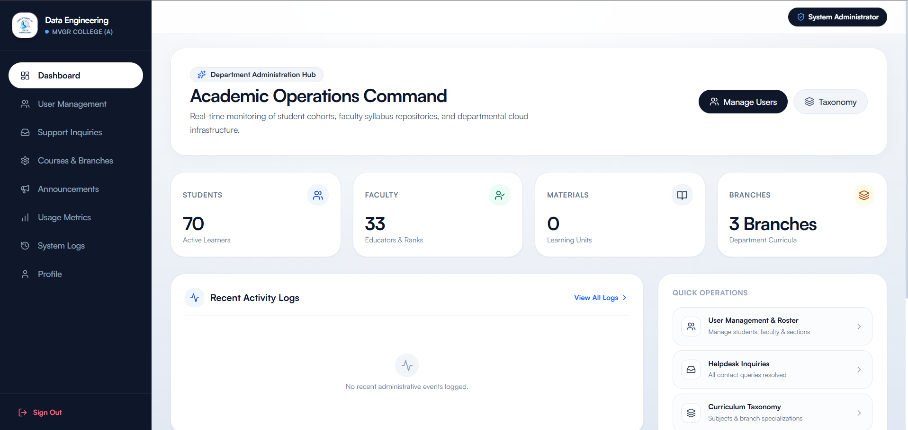

# DataDock • Academic Learning Cloud
> **Department of Data Engineering | Maharaj Vijayaram Gajapathi Raj (MVGR) College of Engineering (Autonomous)**

[](https://nextjs.org/)
[](https://react.dev/)
[](https://tailwindcss.com/)
[](https://www.mysql.com/)
[](https://expressjs.com/)
[](#institutional-governance)

---

## 🏛️ System Overview

**DataDock** is an institutional-grade, high-performance academic resource cloud and curriculum governance platform engineered exclusively for the **Department of Data Engineering** at **MVGR College of Engineering (Autonomous)**.

DataDock centralizes all autonomous curriculum assets, verified lecture notes, laboratory manuals, and previous question papers across specialized data engineering tracks, providing seamless access for students, faculty contributors, and academic administrators.

```
┌─────────────────────────────────────────────────────────────────────────┐
│                       DataDock Academic Cloud                           │
├────────────────────┬───────────────────────────────┬────────────────────┤
│   Student Vault    │         Faculty Studio        │  Admin Governance  │
│  - Curriculum Hub  │  - Material Publishing Engine │  - Role Management │
│  - Document Stream │  - Readership Analytics       │  - Exam Lockouts   │
│  - Quick Bookmarks │  - Cohort Notice Board        │  - Taxonomy CRUD   │
└────────────────────┴───────────────┬───────────────┴────────────────────┘
                                     │
                    Next.js App Router & Express API
              (JWT HttpOnly Auth, RBAC, Rate-Limiting, Multer)
                                     │
             ┌───────────────────────┴───────────────────────┐
             ▼                                               ▼
       MySQL Database                               Hot Storage Vault
 (Hostinger Production / XAMPP)                 (server/uploads/materials/)
```

---

## 🚀 Key Modules & Capabilities

### 👨‍🎓 1. Student Academic Vault
* **Autonomous Curriculum Navigator**: Filter study materials by Autonomous Regulations (`R23`, `R20`, `R19`, `A2`), Department Specializations (`CIC`, `CSD`, `CSM`), and Semesters (`Sem 1` to `Sem 8`).
* **In-Browser Document Streaming**: High-speed, responsive viewer and downloads for PDF, Word documents, PowerPoint presentations, and lab guides.
* **Revision Vault (Bookmarks)**: Save lecture units to a personalized, persistent revision library for targeted semester exam prep.
* **Examination Mode Lockout**: Automatically hides question banks and revision materials during active exam windows to uphold academic integrity.

### 👩‍🏫 2. Faculty Studio & Telemetry
* **Course Publisher**: Multi-file drag-and-drop document upload pipeline with format validation and secure server-side storage.
* **State Management**: Draft and publish materials with instant visibility toggling across specific batches or semesters.
* **Readership Telemetry**: Visual telemetry dashboards monitoring published materials, student download volumes, and active engagement.
* **Department Circulars**: Post targeted announcements and broadcast urgent notices directly to student dashboards.

### 🛠️ 3. Administrative Governance Suite
* **Roster Management**: Manage department user directories, student roll numbers, faculty designations, and institutional email associations.
* **Curriculum Taxonomy Engine**: Dynamic CRUD operations for Autonomous Regulations, Department Branches, Semesters, and Subject Codes.
* **Examination Lockout Scheduler**: Schedule time-bounded material lockdowns for designated branches, cohorts, and subjects.
* **Audit Trail**: Security event logging capturing authentication attempts, credential changes, and material publications.
* **Automated Daily Backups**: Built-in, zero-downtime hot backup engine that executes scheduled database exports daily at **12:20 AM IST** with automated 30-day retention pruning.



---

## 🏢 Departmental Specializations Supported

| Branch Code | Department Specialization | Focus Areas |
| :--- | :--- | :--- |
| **CIC** | Cyber Security and IoT with Blockchain | Network Security, Cryptography, Distributed Ledgers, Smart IoT Systems |
| **CSD** | Data Science | Big Data Engineering, Statistical Modeling, Data Warehousing, Mining |
| **CSM** | Artificial Intelligence & Machine Learning | Deep Learning, NLP, Computer Vision, Autonomous Systems |

---

## 💻 Technology Stack

* **Frontend Framework**: Next.js 16 (App Router, Turbopack, React 19 Server Components)
* **Styling & UI**: Vanilla Tailwind CSS v4, Lucide Icons, Smooth Lenis Kinetic Scroll
* **Backend Runtime**: Node.js, Express 5 REST API, Multer Storage Pipeline
* **Database**: MySQL 8.0 with Connection Pooling and Failover Recovery
* **Authentication**: Stateless JWT in Secure `HttpOnly` Cookies with Role-Based Access Control (RBAC)
* **SEO & Metadata**: Dynamic OpenGraph, JSON-LD Schema.org Structured Data, Automated Sitemaps & RSS Feeds

---

## 📦 Project Directory Structure

```
├── app/                      # Next.js 16 App Router (Pages, Layouts, Server Actions)
│   ├── (public)/             # Public routes (Landing, About, Contact, Privacy, Terms)
│   ├── admin/                # Administrator Governance Suite & Telemetry
│   ├── faculty/              # Faculty Studio & Material Publishing
│   ├── student/              # Student Academic Vault & Bookmarks
│   ├── login/                # Unified Role-Based Authentication
│   ├── error.tsx             # Global Application Error Boundary
│   ├── layout.tsx            # Root Layout with Fontshare Satoshi & Lenis Smooth Scroll
│   └── page.tsx              # DataDock Landing Page
├── components/               # Modular UI Components & Design System
├── lib/                      # Core Adapters, MySQL Database Pool, and Utilities
│   ├── db.ts                 # Production MySQL Connection Pool
│   └── mysql-adapter.ts      # Type-safe Supabase-compatible Query Builder for MySQL
├── public/                   # Static Brand Assets, Manifest, and Icons
├── server/                   # Express Backend Architecture
│   ├── config/               # JWT & Environment Configuration
│   ├── controllers/          # Business Logic & Request Handlers
│   ├── database/             # Schema Migrations, Production Seeds, and Backup Engine
│   │   ├── backup.js         # Automated Daily 12:20 AM IST Backup Scheduler
│   │   ├── init-db.js        # Automated DB Initialization Script
│   │   ├── schema.sql        # Normalized MySQL Database Schema
│   │   └── seed.sql          # Seed Roster, Faculty Directory, and Curriculum
│   ├── middleware/           # RBAC Verification, Upload Pipeline, Security
│   ├── routes/               # Modular REST API Route Handlers
│   └── index.js              # Express API Server Entry Point
├── utils/                    # Shared Helper Functions, SEO, and Security Modules
├── proxy.ts                  # High-Speed Edge Middleware & Route Guard
└── package.json              # Project Dependencies and Build Scripts
```

---

## 🛠️ Local Development Setup

### 1. Prerequisites
* **Node.js**: `v20.x` or `v22.x` (LTS)
* **MySQL**: MySQL 8.0+ or MariaDB (e.g. XAMPP, Docker, or native service)
* **npm**: `v10.x` or higher

### 2. Installation
Clone the repository and install dependencies:

```bash
git clone https://github.com/Aswinsaipalakonda/DE-E-Learn.git
cd DE-E-Learn
npm install
```

### 3. Environment Configuration
Create your local configuration file from the template:

```bash
cp .env.example .env.local
```

Configure your local database credentials:
```env
NODE_ENV="development"
DB_HOST="localhost"
DB_PORT="3306"
DB_USER="root"
DB_PASSWORD="your_mysql_password"
DB_NAME="de_elearn"
JWT_SECRET="your_secure_random_jwt_secret_key"
JWT_EXPIRES_IN="7d"
FRONTEND_URL="http://localhost:3000"
NEXT_PUBLIC_API_URL="/api"
```

### 4. Initialize Database
Create database tables and apply curriculum seed data:

```bash
npm run db:init
```

### 5. Launch Development Server
Run both the Express API and Next.js frontend concurrently:

```bash
npm run dev:all
```

Access the application in your browser:
* **Web Application**: `http://localhost:3000`
* **API Health Check**: `http://localhost:5000/api/health`

---

## 🔒 Security & Best Practices

* **Zero Plaintext Passwords**: All user passwords utilize `bcrypt` cryptographic hashing with minimum work factor 10.
* **HttpOnly Session Tokens**: Authentication tokens are strictly stored in `SameSite=Lax`, `HttpOnly` cookies, fully insulated from Cross-Site Scripting (XSS).
* **Multi-Layer RBAC**: Route guards (`proxy.ts`), server-side component validations, and Express API middleware enforce strict role boundaries (`admin`, `faculty`, `student`).
* **Rate Limiting**: Critical endpoints (such as login) feature dynamic token-bucket rate limiting to mitigate brute-force attacks.
* **SQL Injection Prevention**: All database interactions use prepared statements with parameterized inputs.

---

## 🌐 Production Deployment Architecture

DataDock is optimized for modern containerized hosting environments (such as Hostinger Node.js Web Apps) with custom domain routing:

* **Production URL**: `https://datadock.aswinsai.tech`
* **Static Assets**: Automated Next.js build optimization and image compression.
* **Database Backups**: Self-running background scheduler exporting daily hot backups to `backups/` at 12:20 AM IST.

```bash
# Production Build
npm run build

# Production Server Start
npm run start
```

---

## 📄 Institutional Governance

Designed and maintained for the **Department of Data Engineering**, **MVGR College of Engineering (Autonomous)**, Vizianagaram, Andhra Pradesh, India.
All academic materials, curriculum structures, and institutional datasets remain the exclusive property of the institution.
